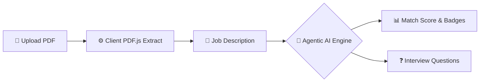

# 🤖 Agentic AI HR Recruitment Assistant

An intelligent, multi-agent candidate screening platform that automates resume parsing, calculates job-match scores, highlights skill gaps, and generates candidate-tailored technical and HR interview questions in seconds.

---

## 🌟 Key Features

- **📄 Privacy-First Resume Parsing**: Uses `pdf.js` to extract text directly in the browser memory—no resume files are stored on external servers.
- **🎯 Algorithmic Match Scoring**: Computes an objective candidate match percentage (0–100%) against job descriptions.
- **🏷️ Skill Gap Visualizer**: Displays side-by-side color-coded badges for **Matched Skills** (Green) and **Missing Skills** (Red).
- **🤖 Autonomous Multi-Agent Pipeline**:
  - **Agent 1 (Parser Agent)**: Extracts candidate identity and clean resume text.
  - **Agent 2 (Skill Matcher)**: Cross-references skills against a 60+ technical tool taxonomy.
  - **Agent 3 (Evaluator Agent)**: Calculates match scores, strengths, and weaknesses.
  - **Agent 4 (Interview Specialist)**: Generates candidate-tailored technical and HR questions.
- **⚡ Dual Engine Architecture**: Leverages **Google Gemini 1.5 Flash API** for deep semantic analysis, with an **Offline Heuristic Engine** backup ensuring 100% uptime.
- **📊 Executive Summaries & Recommendations**: Categorizes applicants as *Strong Hire*, *Hire*, *Consider*, or *Do Not Hire*.

---

## 🛠️ Tech Stack

- **Frontend**: HTML5, CSS3 (Modern Flexbox/Grid), Vanilla JavaScript (ES6+)
- **Document Parsing**: PDF.js (Browser-based text extraction)
- **AI Integration**: Google Gemini 1.5 Flash REST API
- **Python Alternative**: Streamlit, PyPDF (`app.py`)

---

## 🚀 Getting Started

### Option 1: Web Interface (HTTP Server)
1. Clone the repository:
   ```bash
   git clone https://github.com/sreeshnusa/ai-hr-recruitment-assistant.git
   cd ai-hr-recruitment-assistant
   ```
2. Start local server:
   ```bash
   python -m http.server 8080
   ```
3. Open browser at: **`http://localhost:8080`**

### Option 2: Streamlit Dashboard (Python)
1. Install dependencies:
   ```bash
   pip install streamlit pypdf
   ```
2. Run the application:
   ```bash
   streamlit run app.py
   ```

---

## 📂 Project Structure

```text
ai-hr-recruitment-assistant/
├── index.html          # Main HTML UI structure
├── style.css           # Modern design system & responsive layout
├── app.js              # Multi-agent client-side execution engine
├── app.py              # Streamlit python app alternative
├── command.txt         # Sample Job Description (Data Analyst role)
├── .gitignore          # Git exclusion rules
└── README.md           # Project documentation
```

---

## ⚙️ How It Works



---

## 🔒 Security & Data Privacy

- All document text processing occurs in **volatile browser RAM**.
- No candidate resumes or personal identification details are stored in databases or permanent cloud storage.

---

## 👤 Author

Developed by **[Sreesh]**  
- **GitHub**: [@sreeshnusa](https://github.com/sreeshnusa)
